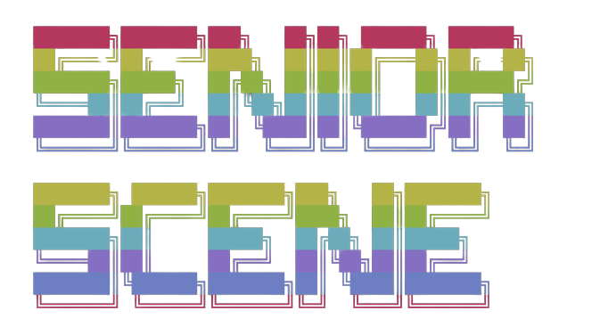
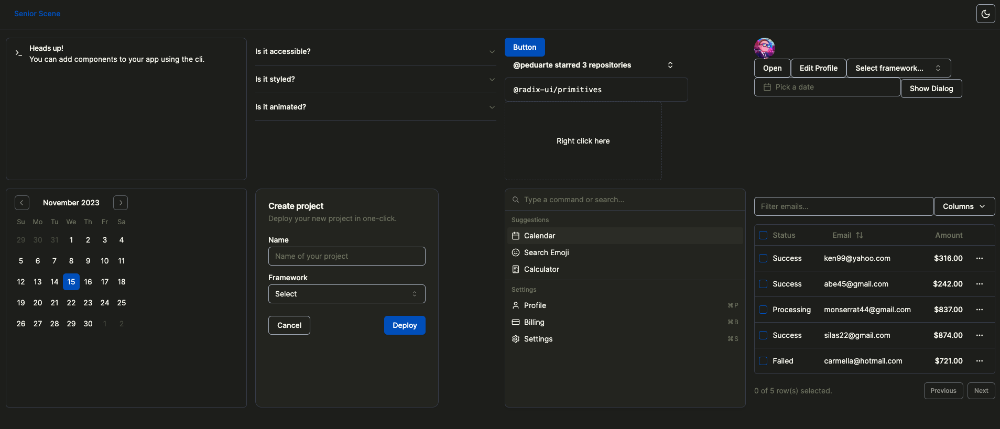
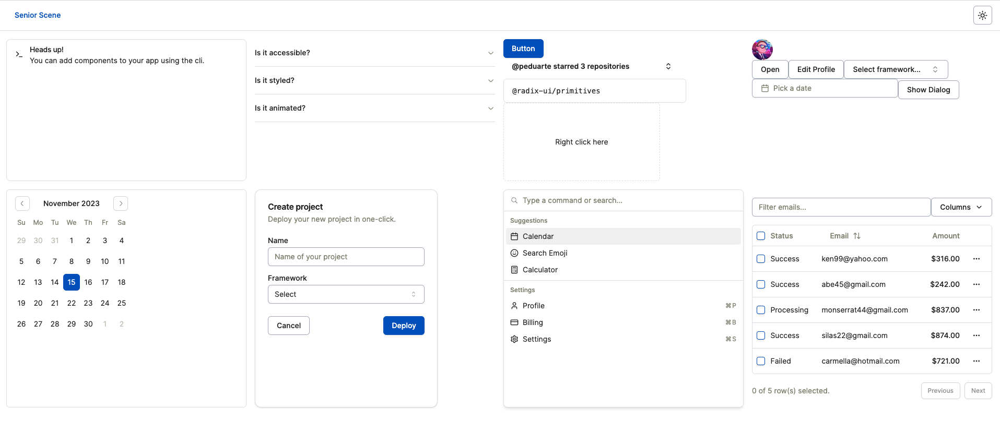

# Senior Scene

Use the init command to initialize dependencies for a new project:

```bash
npx senior-scene@latest init
```



Run the following command to start the development server:

```bash
npm run dev
```

[Playground Live Demo](https://senior-scene-demo.vercel.app/)




